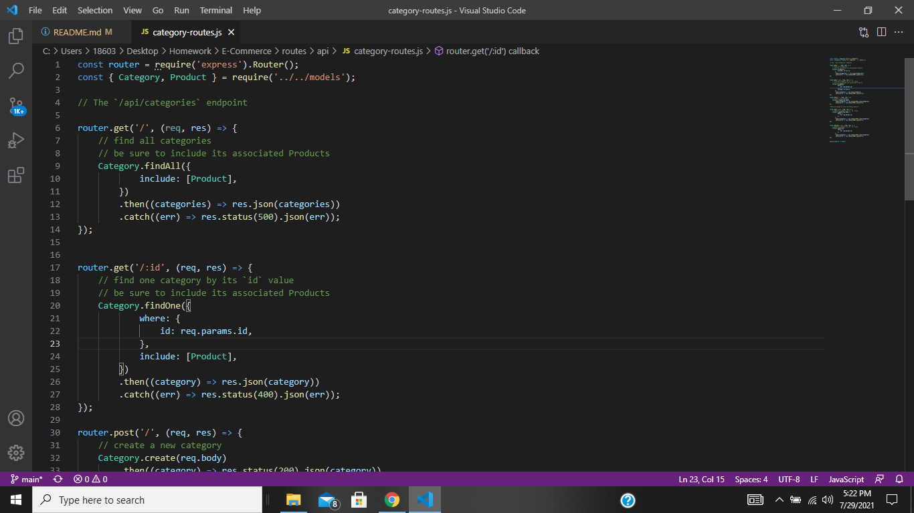
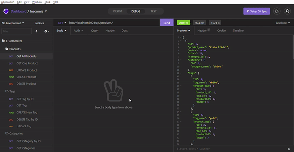
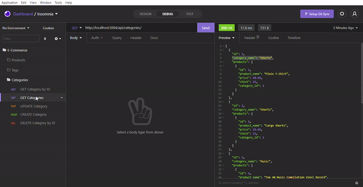
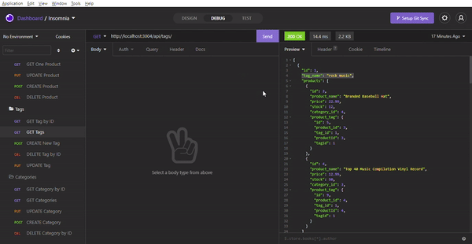

# E-Commerce

E-Commerce Back End project

👨[Github Profile](https://github.com/PratikPatel-Code/)

#

## Table of Contents

- [Project Overview](#Overview)

- [Project Goals](#Goals)

- [Running App](#Running)

- [Testing App](#Testing)

- [Contributers](#Contributers)

- [Technologies](#Technologies)

- [Links](#Links)

#

## Overview:

Your task is to build the back end for an e-commerce site by modifying starter code. You’ll configure a working Express.js API to use Sequelize to interact with a MySQL database.

#

## Goals:

1. Fist routes to code provided
2. Define parameters of models
3. Open insomnia and test

#

## Running: 🏃

- node.js must be installed
- Download the package.json
- run npm i
- npm run seed
- npm start

#

## Testing: 🔬

- Testing will be done in insomnia

#

## Screenshot/Demo 📸

#

#

#

#

#

## Contributers:

👨[Pratik Patel](https://github.com/PratikPatel-Code/)

#

## Technologies: 💻

[Visual Studio](https://visualstudio.microsoft.com/)

[JavaScript](https://www.javascript.com/)

[Node](https://nodejs.org/en/)

[mySQL](https://www.npmjs.com/package/mysql)

[DotENV](https://www.npmjs.com/package/dotenv)

[Express](https://www.npmjs.com/package/express)

[Sequelize](https://www.npmjs.com/package/sequelize)

#

## Links: 🔗

✉️[Email](pratikpatel_85@yahoo.com)

👨[Github Profile](https://github.com/PratikPatel-Code/)

📁[Project Repo](https://github.com/PratikPatel-Code/E-Commerce)
